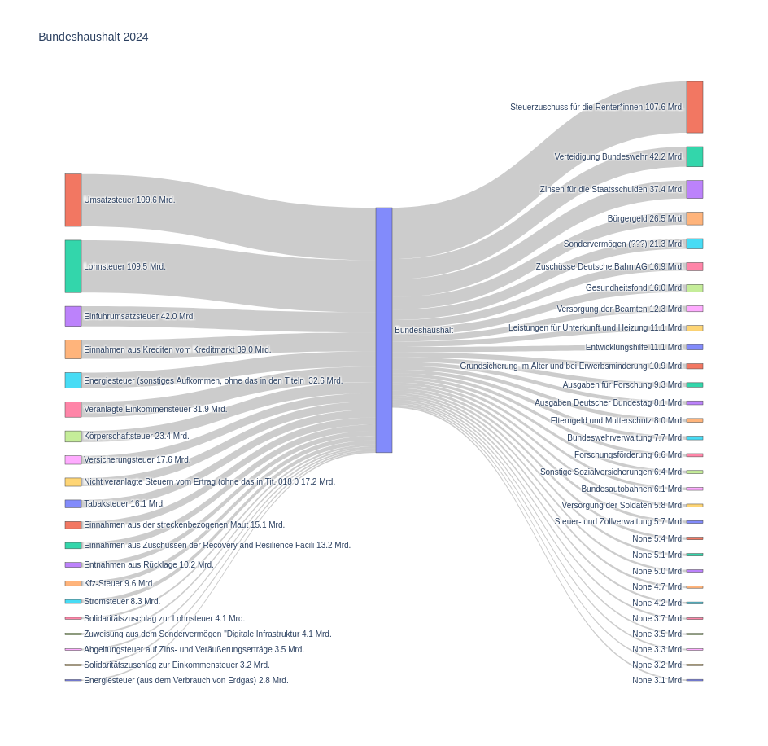

# Auswertung Bundeshaushalt



<https://www.bundeshaushalt.de>  
<https://www.bundeshaushalt.de/DE/Erklaerwelt/erklaerwelt.html>  


## 1. Daten besorgen

<https://www.bundeshaushalt.de/DE/Download-Portal/download-portal.html>  

Folgende Dateien downloaden:

- HAUSHALTSPLAN SOLL 2022 [CSV / UTF8] (Datei 'hh_2022_utf8.csv')  
- HAUSHALTSPLAN SOLL 2023 [CSV] (Datei 'HH_2023.csv')  
- HAUSHALTSPLAN SOLL 2024 [CSV] (Datei 'HH_2024.csv')  

md5sum:

```
bb7ba1d326f4f1fe72e764dff08644bb  hh_2022_utf8.csv
5e27acb6ff12f9c878d45321e8ffebfd  HH_2023.csv
b62dddb19bf9f40ea89533f0ad86e216  HH_2024.csv
```


## 2. Neue Datenbank erstellen

Mit `read_hh_csv.py *.csv` wird eine SQLite Datenbank **haushalt.db** erstellt
und alle CSV Dateien eingelesen.  
Für jeden Haushalt eine Tabelle erstellt.  

In der Datenbank wird noch eine Umsetztabelle der Funktionsnummern benötigt.  
Eine Liste der Funktionen ist im Gesamtpla ab Seite 45 zu finden:  
<https://www.bundeshaushalt.de/static/daten/2024/soll/Gesamtplan%20und%20Uebersichten.pdf>  


## 3. Beschreibung der Daten

Auf der Webseite sind kaum Beschreibungen zu finden...

Hierarchie:
- einzelplan einzelplan-text (2-stellige Nummer)
  - kapitel kapitel-text (4-stellige Nummer)
    - titel funktion titel-text (4-stellige Nummer)

<https://de.wikipedia.org/wiki/Veranlagung_(Steuerrecht)>  
<https://de.wikipedia.org/wiki/Körperschaftsteuer>  
<https://de.wikipedia.org/wiki/Einfuhrumsatzsteuer_(Deutschland)> Zölle  


Erbschaftssteuer steht Bundesländern zu  
Grundsteuer und Gewerbesteuer steht Gemeinden zu  


## 4. Abfrage der Daten

`sqlite3 haushalt.db < bundeshaushalt_2024.sql`  

